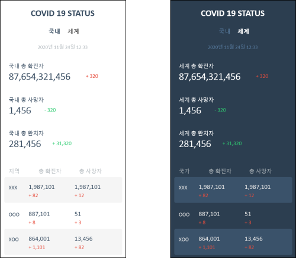
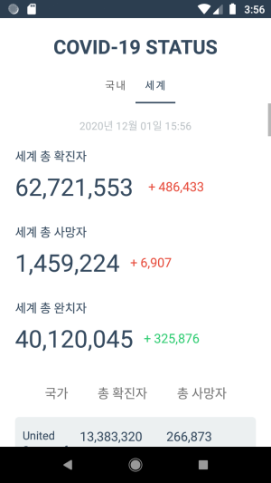
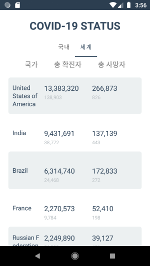

# PlayGround 

이 프로젝트는 토이 프로젝트로서 업무외 시간에 개인적인 목표를 잡고 여러가지의 도메인을 시도해 본다.

## 1. 기본

- Clean architecture
  - 목적에 따라 분리된 레이어를 모듈 단위로 완전히 분리 하여 벽을 세워준다.
  - `app` 모듈 : View, DI, Network등 플랫폼에 의존이 있는 클래스, 함수, 인터페이스등의 구현이 존재 하는 모듈
  - `common` 모듈 : app, model모듈에서 필요한 상수, 유틸리티, 확장 함수, String 자원 등 이 존재 하는 모듈
  - `moddel` 모듈 : ViewModel, Repository, Helper 인터페이스 와 비즈니스 로직이 존재 하는 모듈
- MVVM & Databinding
  - 기본적으로 sub domain에 대해서는 MVVM과 Databinding을 적용
  - 비즈니스 로직은 `Repository`에서 수행하고 그에 대한 콜백으로 처리. 
  - 콜백이 복잡해질 경우 위 `MVVM + Uni-Directional flow event handling & Databinding`으로 처리 
- MVVM + Uni-Directional flow event handling & Databinding
  - MVVM과 Databinding을 사용 하되 Use case에 대해 `Action`과 `State`로 정의 하고 이를 Rx 스트림으로 처리.
  - 단일 스트림은 Uni-directional flow으로 MVI와 Redux등을 생각하면 쉽다.  
  - 이벤트의 트리거에서 콜백 받아 화면 업데이트 까지, 단일 스트림으로 구성 하여 콜백을 최소화. 
- ViewBinding
  - 간단한 view에 대한 처리 및 비즈니스 로직이 전무한 경우 뷰 바인딩만 사용 한다. 
   
- CI (WIP)
  - [github Actions](https://docs.github.com/en/free-pro-team@latest/actions) : 일단 이거 생각중.. 
  - jenkins

- Code quality (WIP)
  - Sonar qube  
    - Kotlin을 대상으로 local server에서 동작.
    - 룰은 기본 룰 에서 커스텀 해서 적용 할 것.  
    - 버그와 취약점은 최대한 낮게 유지.  
    - 개발 서버 추가되면 해당 서버에서 CI와 함께 작동 시킬 수 있을까?
  - Leak canary
  - FB-Crashlytics 
  
- 목표
  - 기술에 대한 경험을 얻기 위해 큰 목표 보다는 작은 목표 단위로 잘게 쪼개고 좋은 코드를 개발하기 위한 고민을 하고 적용 하며, 문제가 있어 진행이 어려우면 과감하게 결정 한다.
  - 단위 테스트 코드는 비즈니스 로직에 한해서 작성한다. 좋은 뷰 단위 테스트 도구가 생기면 테스트 하는 것 도 좋다. 단위 테스트 코드의 '코드 커버리지'는 최소 70% 이상. 
  - 개인적으로 만들고 싶었던 것의 프로토타이핑을 이 토이 프로젝트에서 작성하여 테스트 해 볼 수 있다. 만약 프로토타이핑이 생각보다 괜찮거나 더 발전시키고 싶다면 이 프로젝트에서 분리하는 것도 좋다.
  - 기존 사용되던 라이브러리를 교체 할 경우 브랜치를 추가 하고 해당 브랜치에서 작업하도록 한 뒤 `README.md`파일 에 브랜치간 비교 링크를 추가 한다.
  - 각 도메인 단위로 한개의 Activity만 갖게 되며 여러개의 Fragment가 존재 할 수 있다.  

### 1.1 사용된 라이브러리

- [kotlin](https://kotlinlang.org/)
- jetpack
  - [appcompat](https://developer.android.com/jetpack/androidx/releases/appcompat?hl=ko)
  - [recyclerView](https://developer.android.com/jetpack/androidx/releases/recyclerview?hl=ko)
  - [architecture lifecycle](https://developer.android.com/jetpack/androidx/releases/lifecycle?hl=ko)
  - [navigation](https://developer.android.com/jetpack/androidx/releases/navigation?hl=ko)
  - [paging](https://developer.android.com/jetpack/androidx/releases/paging?hl=ko)
  - [ktx core](https://developer.android.com/jetpack/androidx/releases/core?hl=ko)
  - [ktx-fragment](https://developer.android.com/jetpack/androidx/releases/fragment?hl=ko)
  - [constraintlayout](https://developer.android.com/jetpack/androidx/releases/constraintlayout?hl=ko)
  - [ViewPager2](https://developer.android.com/jetpack/androidx/releases/viewpager2?hl=ko)
  - [SwipeRefreshLayout](https://developer.android.com/jetpack/androidx/releases/swiperefreshlayout?hl=ko)
  - [material](https://developer.android.com/jetpack/androidx/releases/compose-material?hl=ko)
- [multidex](https://developer.android.com/studio/build/multidex?hl=ko)
- [rxandroid](https://github.com/ReactiveX/RxAndroid)
- [dagger-hilt](https://dagger.dev/hilt/)
- [retrofit](https://square.github.io/retrofit/)
- [okhttp](https://square.github.io/okhttp/)
- [moshi](https://github.com/square/moshi)
- [glide](https://github.com/bumptech/glide)
- jUnit
- Mockito

## 2. Domain

`MainActivity`에서 각 도메인으로 이동 할 수 있게 하고, 각 도메인은 서로간 의존을 자제 하거나 최소화 한다.

- MainActivity : 앱 실행시 진입 Activity
  - MainFragment : 하단의 각 서브 도메인으로 진입할 수 있는 버튼들을 갖고 있다. 

### 2.1 covid-19 현황판  

> (TODO) 국내 코로나 api키 제거 되어 갱신 해주어야 함.

국내와 전 세계의 코로나19 현황을 보여준다. 보여주는 정보는 총 확진자, 총 사망자, 총 완치자 및 각 국가 확진자 순위별 정렬된 목록 혹은 국내 시도별 분류된 확진자 및 사망자의 정보를 보여준다. 

One `Activity`에 `Fragment`에서는 `ViewPager2`와 Tab을 구현하여 내부에서는 `SwipeRefreshLayout`와 `RecyclerView`를 이용하여 새로고침을 비롯한 내부 UI를 구현 하였다. 간단한 러프 기획은 아래 이미지와 같다. 

  

`RecyclerView`의 경우 `ListAdapter`와 `DiffUtil`을 사용 하였다. recycler view의 UI는 두가지 view type으로 나누어서 구현 하였다. 추가적으로 다크모드를 제공 할 수 있도록 `color`셋 을 추가하였다.

- [ListAdapter 구현 보기](https://github.com/ksu3101/PlayGround/blob/master/app/src/main/java/com/swkang/playground/view/covid19/Covid19StatusListAdapter.kt)
- [ViewModel 구현 보기](https://github.com/ksu3101/PlayGround/blob/master/model/src/main/java/com/swkang/model/domain/covid19/Covid19StatusViewModel.kt)
  - [ViewModel의 테스트 코드 보기](https://github.com/ksu3101/PlayGround/blob/master/model/src/test/java/com/swkang/model/domain/covid19/Covid19StatusViewModelTest.kt)
- [Repository의 구현 클래스 보기](https://github.com/ksu3101/PlayGround/blob/master/app/src/main/java/com/swkang/playground/repository/covid19/Covid19RepositoryImpl.kt)
  - covid19 현황판 서브 도메인에서는 2개의 api를 필요로 하는데 이 때 Qualifier를 이용해 Retrofit API인스턴스를 구분 해 줘야 한다. 그에 대한 Retrofit2의 [DI 모듈은 이 링크를 참고 한다.](https://github.com/ksu3101/PlayGround/blob/master/app/src/main/java/com/swkang/playground/base/di/network/Covid19NetworkModule.kt)  

#### 2.1.1 국내 현황

  

- 국내 코로나19 정보 : [Corona-19-API](https://github.com/dhlife09/Corona-19-API)
  - 국내 코로나19 정보 api는 미진한 부분이 있어 어쩔수 없이 하드코딩된 부분이 추가 되었음. 
  - 국내 코로나 통합정보와 각 시도별 정보는 api가 따로 존재 한다. 그렇기 때문에 두개의 api를 Rx를 통해 비동기로 호출 하고 그에 따른 response를 Rx의 `Single`으로 받은 다음 이를 `zip`으로 합쳐서 Rx Single 소스로 내려주게 한다.  
  - 이 Api의 경우 secret api key를 필요로 하기 때문에 이 키를 따로 보관 하고 git에는 업로드 하지 않았다.  

#### 2.1.2 세계 현황 

    

- 국외 코로나19 정보 : [https://api.covid19api.com/](https://documenter.getpostman.com/view/10808728/SzS8rjbc)
  - 가끔 서버 내부 캐시를 정리 하거나 여러가지 이유로 API가 정상작동 하지 않을때가 있는데, 문제는 이를 오류 response code로 내려주지 않는 경우가 있다. 이런 경우에 대한 에러 핸들링이 어려워 일단 처리를 보류 하였다. 

### 2.2 우주에는 지금 누가 있을까? (WIP) 

- open api인 [How Many People Are In Space Right Now](http://api.open-notify.org/astros.json)을 이용하여 결과를 화면에 보여주는 간단한 앱. 
- Uni-Direction Flow를 녹인 Action-State을 Use case로 녹인 비즈니스 처리 구조를 적용.
- `Action` : State를 변화시킬 수 있는 유일한 방법으로서, Action이 dispatch 되어야 한다.   
- `State` : 처리된 Action을 바탕으로 만들어진 화면의 상태를 정의한 불변 데이터 클래스(Immutable data class).
  - State는 `StateRepository`를 통해서 publish된다. state listener(Observable source)를 구독 한다면 해당 Observable source를 받아을 수 있으며 이를 `StateViewModel`의 `render()` 에서 State를 처리(뷰의 갱신) 하면 된다.  
- `StateRepository` : Action을 dispatch할수 있게 Api를 제공 하고 dispatch된 Action을 State로 만들기 위한 비즈니스 로직을 수행하는 클래스.
- `StateViewModel` : State를 받아 Render 하는 ViewModel. 
  - `fun render(state: S)` : State를 처리 하는 추상 함수.  

### 2.3 구글 인앱 결제 테스트 모듈

- [구글 Play 인앱 결제](https://developer.android.com/google/play/billing?hl=ko) 개발자 테스트용. 

### 2.4 서브 도메인 4

(WIP)

## ETC

개발 테스트용으로 괜찮은 json을 내려주는 open API [목록 사이트](https://project-awesome.org/jdorfman/awesome-json-datasets).

- NASA
  - [ISS station location](http://api.open-notify.org/iss-now.json)
  - [우주에는 지금 누가 있을까?](http://api.open-notify.org/astros.json)

- Corona 19
  - [Corona-19-API](https://github.com/dhlife09/Corona-19-API)
  - [Coronavirus COVID19 API](https://documenter.getpostman.com/view/10808728/SzS8rjbc)
  
- 포켓몬 
  - [Pokemon](https://pokeapi.co/docsv2/)
  - [pokedex](https://raw.githubusercontent.com/Biuni/PokemonGO-Pokedex/master/pokedex.json)
  
- 이건 그냥 참고용 : [awesome-stacks](https://github.com/stackshareio/awesome-stacks)